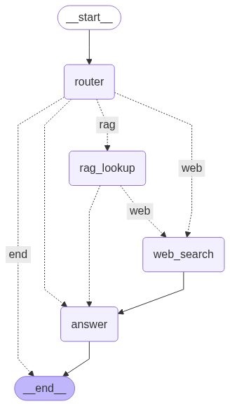

# 🤖 AxonBot – Unified AI RAG Agent


AxonBot is an **AI RAG (Retrieval-Augmented Generation) agent** that unifies **web search** and **document understanding** into one intelligent assistant.  
It can answer queries using:
- 📂 Uploaded knowledge base (via vectorstore)
- 🌐 Internet search
- 🧠 LLM reasoning

---

## 🚀 Features
- **Hybrid Search**: Combines RAG (knowledge base lookup) with web search.
- **Smart Routing**: Dynamically decides whether to fetch from RAG, search the web, or directly answer.
- **Extensible**: Built with modular components using **LangGraph**.
- **Frontend**: [Streamlit](https://streamlit.io/) for interactive UI.
- **Backend**: [FastAPI](https://fastapi.tiangolo.com/) for API handling.
- **Vector Store**: [Pinecone](https://www.pinecone.io/) for document embeddings.

---

## 🛠️ Tech Stack
- **Frontend**: Streamlit  
- **Backend**: FastAPI  
- **AI Frameworks**: LangChain + LangGraph  
- **Vector Database**: Pinecone  
- **Model**: LLM  (Gemini / Groq )

---

## ⚡ Workflow

AxonBot’s workflow is defined as a **LangGraph Agent State Graph**.

### 🧩 Agent State Graph
Below is the **workflow diagram** of AxonBot:



---

## 🖼️ UI Screenshot

Here’s a preview of the AxonBot user interface:


---

## 📦 Installation

1. **Clone the repo**
   ```bash
   git clone https://github.com/bisVo159/AxonBot.git
   cd AxonBot
2. **Install dependencies:**  
   `pip install -r requirements.txt`

3. **Run backend:**  
   `uvicorn backend.main:app --reload`

4. **Run frontend:**  
   `streamlit run frontend/app.py`

5. **Set up environment variables in `.env`:**

   ```env
   GOOGLE_API_KEY=
   TAVILY_API_KEY=
   GROQ_API_KEY=
   PINECONE_API_KEY=
   PINECONE_INDEX_NAME=
   EMBED_MODEL=

## 👨‍💻 Author

**Anik Biswas**  
📍 Kolkata, India  
🚀 Building backend, generative AI, and AIML applications.
